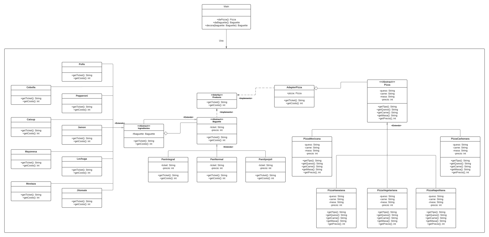

## Práctica 3: Decorator y Adapter
### Menciona los principios de diseño esenciales del patrón Decorator y Adapter

+ __Decorator__: Añade funcionalidad al objeto en tiempo de ejecución. Es también una alternativa a las subclases con tal función extra

  Los principios que sigue este patrón son:
   - Abierto - Cerrado: La clase a decorar no debería modificarse pero puede extenderse gracias al uso de decoradores 

+ __Adapter__:  Convierte la interfaz de una clase en otra interfaz que se adapte a la que el cliente espera. Permite a las clases trabajar juntas, a pesar de que sus interfaces sean incompatibles.

  Los principios que sigue este patrón son:
   - Responsabilidad única: la clase solo se encarga de ver un objeto como de otra clase.
   - Abierto - cerrado: Ninguna clase debería poder modificarse sin embargo podemos una clase como otra a pesar de ser incompatibles
 
### Menciona una desventaja de cada patrón.

- __Decorator__: Es difícil eliminar un decorador así como implementar un decorador sin que su uso dependa del orden en que se implementó

- __Adapter__: Puede ser tedioso crear muchos adaptadores para adaptar diferentes clases, en ocasiones es mejor hacer que la clase coincida con el resto del código

### Sobre la práctica:
__Decorator__ se usa cuando necesitamos ponerle los ingredientes a nuestros baguettes y **Adapter** cuando queremos obtener el ticket de una pizza.
El programa pregunta si el cliente desea una pizza o cliente; en caso de ser pizza el cliente elige el tipo de pizza, la pizza se adapta a un producto y se imprime su ticket; en caso de ser baguette el cliente elige el tipo de pan y posterior a ello los ingredientes, de igual manera se imprime el ticket.
Notemos que para elegir tanto pizza, baguette y decoradores usamos métodos que nos digan justo el tipo de cada pan o baguette, siguiendo un poco la idea del patrón Factory
**Ojo**: No estamos afirmando que usamos el patrón Factory, solo la idea detrás de este.

No se necesita de algún software adicional para el funcionamiento de la práctica. Puede ser fácilmente compilada con:

`$javac *.java`

Y ejecutada con

`$java Main.java`

### Diagrama de clases

